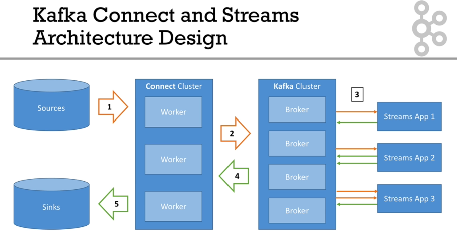
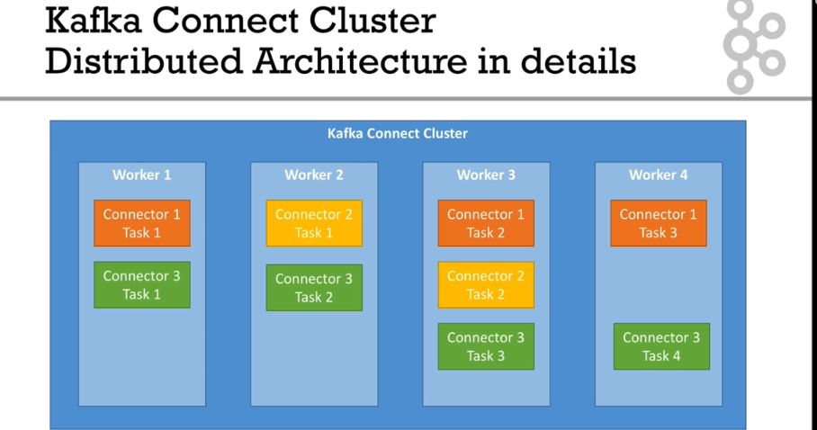
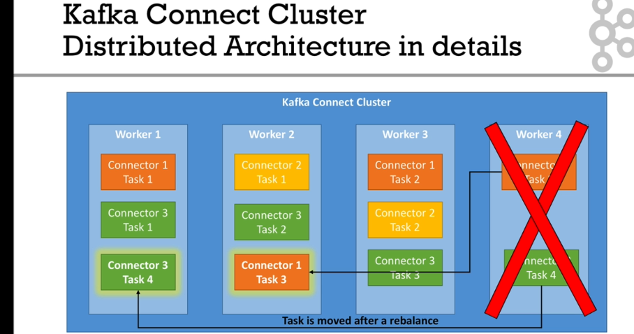

# Kafka Connect

Currently there are four common Kafka use cases:

1. Source -> Kafka (`Producer API`)
2. Kafka -> Kafka (`Consumer, Producer API, Kafka Streams`)
3. Kafka -> Sink (`Consumer API`)
4. Kafka -> App (`Consumer API`)

So kafka connect, provides easy ways to implement the Cases 1 and 3, it simplifies and improve getting data in and out of Kafka.

Therefore it solves several common problems like:

- Programmers always want to import data from the same sources (Databases, SQS, MQTT, Twitter etc)

- Programmers always want to store data in the same sinks (S3, Elasticsearch, HDFS, JDBC, Splunk, Twitter)

- Achieve Fault Tollerance, Exactly Once, Distribution, Ordering etc

With Kafka Connect other programmers may already have done a very good jod, writting plugins to it.

## Kafka Connect and Streams Architecture

1. Kafka Connect extracts data from source
2. Kafka Connect sends data to Kafka Cluster
3. (optional) Kafka Streams enrich data pushing it back to Kafka Cluster
4. Kafka Connect consumes data from Kafka Cluster
5. Kafka Connect send data to a sink

## Kafka Connect Concepts

- `Source Connectors` - Extract data from source and push it to Kafka
- `Sink Connectors` - Consume data from Kafka and save it in Sink
- `Kafka Connect Cluster` - Has multiple loaded `Connectors`
- `Kafka Connector` - Reusable piece of code (java jars)
- `Tasks` - Connector with user configuration
- `Kafka Connect workers` - Servers that execute `Tasks` in Standalone or Distributed Mode

### Advantages

- Make easy for non-experienced dev to quickly get data reliably into Kafka
- Part of ETL Pipeline
- Scaling made easy from small pipelines to company-wide pipelines
- Reusable code

##  Kafka Connect Works: Standalone vs Distributed Mode

In kafka connect a task could be run in the standalone or distributed mode:

- `Standalone` 
    - A single process runs your connectors and tasks
    - Configuration is bundled with your process
    - Very easy to get started with, useful for development and testing
    - Not fault tolerant, no scalability, hard to monitor

- `Distributed`
    - Multiple workers run your connectors and tasks
    - Configuration is submitted using a Rest API
    - Easy to scale, and fault tolerant
    - useful for production deployment of connectors

    ### Distributed Mode Architecuture

    

    ### In case of failure

    