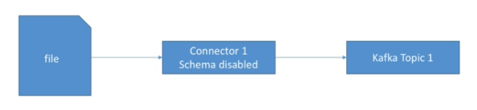

# Kafka Connect Source

The first connector that will explore will be [FileStreamSourceConnector](https://docs.confluent.io/platform/current/connect/filestream_connector.html). The ideia is read a file and load the content directly into kafka.



## Running FileStreamSourceConnector in Standalone Mode

In order to run Kafka connector it is necessary to perform 2 things:

- `Configure Worker` - look at [worker.properties file](./artifacts/code/source/demo-1/worker.properties)
```bash
# from more information, visit: http://docs.confluent.io/3.2.0/connect/userguide.html#common-worker-configs
bootstrap.servers=127.0.0.1:9092
key.converter=org.apache.kafka.connect.json.JsonConverter
key.converter.schemas.enable=false
value.converter=org.apache.kafka.connect.json.JsonConverter
value.converter.schemas.enable=false
# we always leave the internal key to JsonConverter
internal.key.converter=org.apache.kafka.connect.json.JsonConverter
internal.key.converter.schemas.enable=false
internal.value.converter=org.apache.kafka.connect.json.JsonConverter
internal.value.converter.schemas.enable=false
# Rest API
rest.port=8086
rest.host.name=127.0.0.1
# this config is only for standalone workers
offset.storage.file.filename=standalone.offsets
offset.flush.interval.ms=10000
```

- `Configure the Connector` - look at this [file](./artifacts/code/source/demo-1/file-stream-demo-standalone.properties)
```bash
# These are standard kafka connect parameters, need for ALL connectors
name=file-stream-demo-standalone
connector.class=org.apache.kafka.connect.file.FileStreamSourceConnector
tasks.max=1
# Parameters can be found here: https://github.com/apache/kafka/blob/trunk/connect/file/src/main/java/org/apache/kafka/connect/file/FileStreamSourceConnector.java
file=demo-file.txt
topic=demo-1-standalone

```

- `Run the following commands`


```bash
cd ./artifacts/code/

# Runs Kafka Cluster
docker-compose up kafka-cluster

# creates a pod to execute kafka commands
docker run --rm -it -v "$(pwd)":/tutorial --net=host landoop/fast-data-dev:cp3.3.0 bash

# creates kafka topic
kafka-topics --create --topic demo-1-standalone --partitions 3 --replication-factor 1 --zookeeper 127.0.0.1:2181

cd ./tutorial/source/demo-1

# Create the Connector in Standalone Mode
connect-standalone worker.properties file-stream-demo-standalone.properties

```

## Running FileStreamSourceConnector in Distributed Mode

Follow the commands below to run the connector in distributed Mode

```bash
cd ./artifacts/code/

# Runs Kafka Cluster
docker-compose up kafka-cluster

# creates a pod to execute kafka commands
docker run --rm -it -v "$(pwd)":/tutorial --net=host landoop/fast-data-dev:cp3.3.0 bash

# creates kafka topic
kafka-topics --create --topic demo-2-distributed --partitions 3 --replication-factor 1 --zookeeper 127.0.0.1:2181

# head over to 127.0.0.1:3030 -> Connect UI
# Create a new connector -> File Source
# Paste the configuration at source/demo-2/file-stream-demo-distributed.properties

docker container ls # get the container ID
docker exec -it <containerId> bash
touch demo-file.txt
echo "hi" >> demo-file.txt
echo "hello" >> demo-file.txt
echo "from the other side" >> demo-file.txt
```

## Consuming Messages from Topic

In order to consume messages from topic, using the console follow the commands below

```bash
docker run --rm -it --net=host landoop/fast-data-dev:cp3.3.0 bash
kafka-console-consumer --topic demo-2-distributed --from-beginning --bootstrap-server 127.0.0.1:9092
```