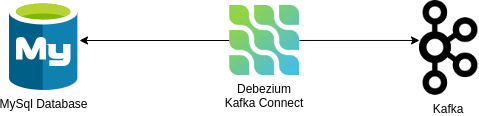

# Kafka Connect Source Debezium

One of the common task when working with kafka is extract data and load them in Kafka. Usually this data is located in databases, [Debezium](https://debezium.io/) allows to extract the data using `change data capture` strategy. In order words, kafka connect debezium extract the data looking at the logs file and stream it to kafka

So, this is the goal:




In order to setup this environment follow this steps:

1- `Setup the Development Environment` - Run docker-compose to provision the kafka cluster and Mysql Database
```bash
cd ./artifacts/code/

docker-compose up -d
```

2- `Explore the MySQL Data` - The Mysql database has some demo data explore it
```bash
# Deploys MySQL Client
docker run -it --net=host --rm --name mysqlterm --rm mysql:5.7 sh -c 'exec mysql -h 0.0.0.0 -uroot -pdebezium'
# Select a database
use inventory;
# List all tables in database
show tables;
# Show the customers database data
SELECT * FROM customers;
```

3- `Create Debezium Kafka Connect Task` - This connector task will be responsible to extract all data from `inventory database` and load them into kafka topics

- Create using this configuration [file](./artifacts/code/source/demo-3/mysql-debezium-distributed.properties)
```bash
name=inventory-connector
connector.class=io.debezium.connector.mysql.MySqlConnector
tasks.max=1
# Database Information
database.hostname=mysql 
database.port=3306
database.user=debezium
database.password=dbz
database.server.id=184054

# Topic Prefix for each database loaded
topic.prefix=dbserver1
# database to include
database.include.list=inventory

# Kafka Information
schema.history.internal.kafka.bootstrap.servers=kafka-cluster:9092 
schema.history.internal.kafka.topic=schema-changes.inventory 
```

```bash
curl -i -X POST -H "Accept:application/json" -H "Content-Type:application/json" localhost:8083/connectors/ -d '{ "name": "inventory-connector", "config": { "connector.class": "io.debezium.connector.mysql.MySqlConnector", "tasks.max": "1", "database.hostname": "mysql", "database.port": "3306", "database.user": "debezium", "database.password": "dbz", "database.server.id": "184054", "topic.prefix": "dbserver1", "database.include.list": "inventory", "schema.history.internal.kafka.bootstrap.servers": "kafka-cluster:9092", "schema.history.internal.kafka.topic": "schemahistory.inventory" } }'
```

4- `Consume the Topic dbserver1.inventory.customers`
```bash
docker run --rm -it --net=host landoop/fast-data-dev:cp3.3.0 bash
apk update && apk add jq

# keep this consumer running to see all events
kafka-avro-console-consumer --topic dbserver1.inventory.customers  --from-beginning --bootstrap-server 127.0.0.1:9092 | jq


# Event from Snapshot - First Run from Kafka Connect
{
  "before": null,
  "after": {
    "dbserver1.inventory.customers.Value": {
      "id": 1003,
      "first_name": "Edward",
      "last_name": "Walker",
      "email": "ed@walker.com"
    }
  },
  "source": {
    "version": "2.3.2.Final",
    "connector": "mysql",
    "name": "dbserver1",
    "ts_ms": 1691690928000,
    "snapshot": {
      "string": "true"
    },
    "db": "inventory",
    "sequence": null,
    "table": {
      "string": "customers"
    },
    "server_id": 0,
    "gtid": null,
    "file": "mysql-bin.000003",
    "pos": 157,
    "row": 0,
    "thread": null,
    "query": null
  },
  "op": "r",
  "ts_ms": {
    "long": 1691690928204
  },
  "transaction": null
}

```

5- `Change data in mysql and look the events comming` - Use the Mysql Client to change data in `inventory.customers` database

```bash
# Deploys MySQL Client
docker run -it --net=host --rm --name mysqlterm --rm mysql:5.7 sh -c 'exec mysql -h 0.0.0.0 -uroot -pdebezium'
# Select a database
use inventory;

# Update Customers
UPDATE customers SET first_name='Anne Marie' WHERE id=1004;

# Delete Customers
DELETE FROM addresses WHERE customer_id=1004;
DELETE FROM customers WHERE id=1004;
```

6- `Results`
```bash
# Event from Update
{
  "before": {
    "dbserver1.inventory.customers.Value": {
      "id": 1004,
      "first_name": "Anne",
      "last_name": "Kretchmar",
      "email": "annek@noanswer.org"
    }
  },
  "after": {
    "dbserver1.inventory.customers.Value": {
      "id": 1004,
      "first_name": "Anne Marie",
      "last_name": "Kretchmar",
      "email": "annek@noanswer.org"
    }
  },
  "source": {
    "version": "2.3.2.Final",
    "connector": "mysql",
    "name": "dbserver1",
    "ts_ms": 1691691590000,
    "snapshot": {
      "string": "false"
    },
    "db": "inventory",
    "sequence": null,
    "table": {
      "string": "customers"
    },
    "server_id": 223344,
    "gtid": null,
    "file": "mysql-bin.000003",
    "pos": 401,
    "row": 0,
    "thread": {
      "long": 14
    },
    "query": null
  },
  "op": "u",
  "ts_ms": {
    "long": 1691691590824
  },
  "transaction": null
}


# Event from Delete
{
  "before": {
    "dbserver1.inventory.customers.Value": {
      "id": 1004,
      "first_name": "Anne Marie",
      "last_name": "Kretchmar",
      "email": "annek@noanswer.org"
    }
  },
  "after": null,
  "source": {
    "version": "2.3.2.Final",
    "connector": "mysql",
    "name": "dbserver1",
    "ts_ms": 1691691661000,
    "snapshot": {
      "string": "false"
    },
    "db": "inventory",
    "sequence": null,
    "table": {
      "string": "customers"
    },
    "server_id": 223344,
    "gtid": null,
    "file": "mysql-bin.000003",
    "pos": 1163,
    "row": 0,
    "thread": {
      "long": 14
    },
    "query": null
  },
  "op": "d",
  "ts_ms": {
    "long": 1691691661699
  },
  "transaction": null
}
```