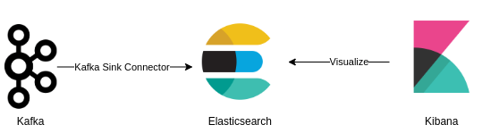

# Kafka Connect Sink Elasticsearch

Once data is in Kafka topic, it is necessary to move it to a new destination, usually to a new database, application or data lake. For this demo, we will move data to an elasticsearch cluster using [ElasticSearch Sink Connector](https://www.confluent.io/hub/confluentinc/kafka-connect-elasticsearch)


So, this is the goal:




In order to setup this environment follow this steps:

1. `Setup the Development Environment` - Run docker-compose to provision the kafka cluster and Mysql Database
```bash
cd ./artifacts/code/

docker-compose up -d
```

2. `Setup Kafka Debezium Source Connector` - Run all steps from [02-KafkaConnectSourceDebezium](./02-KafkaConnectSourceDebezium.md) 

3. `Create ElasticSearch Kafka Connect Sink Task` - This connector will consume all data from `dbserver1.inventory.customers` topic and send it to Elasticsearch

Here there some important steps to highlight, debezium message extract contains a lot of information since it is a log, and for elasticsearch data it is necessary just the field `after` in the message produced from debezium. So we will configure the ElasticSearch Connector to use the transformation [New Record State Extraction](https://debezium.io/documentation/reference/2.3/transformations/event-flattening.html). Which will modify the message dumped into elasticsearch to contain just the value inside `after` field. 

```bash
# Prior New Record State Extraction
{
  "before": {
    "dbserver1.inventory.customers.Value": {
      "id": 1004,
      "first_name": "Anne",
      "last_name": "Kretchmar",
      "email": "annek@noanswer.org"
    }
  },
  "after": {
    "dbserver1.inventory.customers.Value": {
      "id": 1004,
      "first_name": "Anne Marie",
      "last_name": "Kretchmar",
      "email": "annek@noanswer.org"
    }
  },
  "source": {
    "version": "2.3.2.Final",
    "connector": "mysql",
    "name": "dbserver1",
    "ts_ms": 1691691590000,
    "snapshot": {
      "string": "false"
    },
    "db": "inventory",
    "sequence": null,
    "table": {
      "string": "customers"
    },
    "server_id": 223344,
    "gtid": null,
    "file": "mysql-bin.000003",
    "pos": 401,
    "row": 0,
    "thread": {
      "long": 14
    },
    "query": null
  },
  "op": "u",
  "ts_ms": {
    "long": 1691691590824
  },
  "transaction": null
}

# After New Record State Extraction
{
    "id": 1004,
    "first_name": "Anne Marie",
    "last_name": "Kretchmar",
    "email": "annek@noanswer.org"
}
```

Also, another transformation is required, but this time in the key field. Elasticsearch requires a simple field in the key part of the message to use as ID, and debezium use a json strutucture. Thus, the transformation [ExtractField](https://docs.confluent.io/platform/current/connect/transforms/extractfield.html#extractfield) will be used to format the key section of the message

```bash
# Key Prior Extract Field Transformation
{
    "id": 1004
}

# Key After Extract Field Transformation
1004
```

Create the connector using this configuration [file](./artifacts/code/sink/demo-elasticsearch/sink-elastic-distributed.properties)
```bash
# Basic configuration for our connector
name=sink-elastic-customer-distributed
connector.class=io.confluent.connect.elasticsearch.ElasticsearchSinkConnector
# We could parallel this task to increase performance
tasks.max=2

# Topic to be consumed
topics=dbserver1.inventory.customers

# Transformations
transforms=unwrap,extractId
transforms.unwrap.type=io.debezium.transforms.ExtractNewRecordState
transforms.unwrap.delete.handling.mode=rewrite
transforms.extractId.type=org.apache.kafka.connect.transforms.ExtractField$Key
transforms.extractId.field=id

# Elasticsearch configuration
connection.url=http://elasticsearch:9200
key.ignore=false
schema.ignore=true
```

```bash
curl -i -X POST -H "Accept:application/json" -H "Content-Type:application/json" localhost:8083/connectors/ -d '{ "name": "elasticsearch-connector", "config": { "connector.class": "io.confluent.connect.elasticsearch.ElasticsearchSinkConnector", "transforms.unwrap.delete.handling.mode": "rewrite", "tasks.max": "2", "topics": "dbserver1.inventory.customers", "transforms.extractId.type": "org.apache.kafka.connect.transforms.ExtractField$Key", "transforms": "unwrap,extractId", "transforms.unwrap.type": "io.debezium.transforms.ExtractNewRecordState", "transforms.extractId.field": "id", "connection.url": "http://elasticsearch:9200", "key.ignore": "false", "schema.ignore": "true" }}'
```

4. `Check the data on Elasticsearch` - You can access Kibana on "localhost:5602" to explore the data, or use follow command:

```bash
curl -X GET localhost:9200/dbserver1.inventory.customers/_search | jq
```