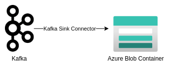

# Kafka Connect Sink Azure Blob

Once data is in Kafka topic, it is necessary to move it to a new destination, usually to a new database, application or data lake. For this demo, we will move data to Azure Blob Storage using [Azure Blob Storage Sink Connector](https://www.confluent.io/hub/confluentinc/kafka-connect-azure-blob-storage)

So, this is the goal:



In order to setup this environment follow this steps:

1. `Setup the Development Environment` - Run docker-compose to provision the kafka cluster and Mysql Database
```bash
cd ./artifacts/code/

docker-compose up -d kafka-cluster mysql
```

2. `Setup Kafka Debezium Source Connector` - Run all steps from [02-KafkaConnectSourceDebezium](./02-KafkaConnectSourceDebezium.md) 

3. `Create an Azure Storage Account` - Follow this [tutorial](https://learn.microsoft.com/en-us/azure/storage/common/storage-account-create?tabs=azure-portal) in order to create an Azure Storage Account

4. `Create Azure Blob Sink Task` - This connector will consume all data from `dbserver1.inventory.customers`, `dbserver1.inventory.products` and `dbserver1.inventory.addresses` topics sending them to Azure Blob

There  aresome important steps to highlight, debezium message extracted contains a lot of information since it is a log, and for Azure Blob data it is necessary just the field `after` in the message produced from debezium. So we will configure the Azure Blob Connector to use the transformation [New Record State Extraction](https://debezium.io/documentation/reference/2.3/transformations/event-flattening.html). Which will modify the message dumped into Blob to contain just the value inside `after` field. Furthermore, we will include in the Record value the timestamp `ts_ms` which debezium extracted the event using the command `"transforms.unwrap.add.fields":"ts_ms"`

Also, the [ReplaceField](https://docs.confluent.io/platform/current/connect/transforms/replacefield.html) transformation is used to modified the field `__deleted` and `__ts_ms` to `deleted` and `timestamp` respectively.

```bash
# Prior New Record State Extraction
{
  "before": {
    "dbserver1.inventory.customers.Value": {
      "id": 1004,
      "first_name": "Anne",
      "last_name": "Kretchmar",
      "email": "annek@noanswer.org"
    }
  },
  "after": {
    "dbserver1.inventory.customers.Value": {
      "id": 1004,
      "first_name": "Anne Marie",
      "last_name": "Kretchmar",
      "email": "annek@noanswer.org"
    }
  },
  "source": {
    "version": "2.3.2.Final",
    "connector": "mysql",
    "name": "dbserver1",
    "ts_ms": 1691691590000,
    "snapshot": {
      "string": "false"
    },
    "db": "inventory",
    "sequence": null,
    "table": {
      "string": "customers"
    },
    "server_id": 223344,
    "gtid": null,
    "file": "mysql-bin.000003",
    "pos": 401,
    "row": 0,
    "thread": {
      "long": 14
    },
    "query": null
  },
  "op": "u",
  "ts_ms": {
    "long": 1691691590824
  },
  "transaction": null
}

# After New Record State Extraction
{
    "id": 1004,
    "first_name": "Anne Marie",
    "last_name": "Kretchmar",
    "email": "annek@noanswer.org",
    "__deleted": "false",
    "__ts_ms": 1691691590000
}

# After ReplaceField Transformation
{
    "id": 1004,
    "first_name": "Anne Marie",
    "last_name": "Kretchmar",
    "email": "annek@noanswer.org"
    "deleted": "false",
    "timestamp": 1691691590000
}
```


Finally, create the connector using this configuration [file](./artifacts/code/sink/demo-azureblob/sink-azureblob-distributed.properties)

```bash
# Basic configuration for our connector
name=sink-azure-blob-connector
connector.class=io.confluent.connect.azure.blob.AzureBlobStorageSinkConnector
# We could parallel this task to increase performance
tasks.max=1

# Topic to be consumed
topics=dbserver1.inventory.customers,dbserver1.inventory.products,dbserver1.inventory.addresses
# Transformations
transforms=unwrap,renameField
# Simplify Debezium Record extracting just the after field
transforms.unwrap.type=io.debezium.transforms.ExtractNewRecordState
# Include the delete information into record's value
transforms.unwrap.delete.handling.mode=rewrite
# Include timestamp on extract record
transforms.unwrap.add.fields=ts_ms
# Rename field __ts_ms to timestamp, __deleted to delete
transforms.renameField.type=org.apache.kafka.connect.transforms.ReplaceField$Value
transforms.renameField.renames=__ts_ms:timestamp,__deleted:deleted


# Azure Blob configuration
azblob.account.name=kedablobstorage
azblob.account.key=fxfhlrUi50rlJpyB/3vXJs9jg8DlVr3Hn4hzeW8ITFDD203evXqIgWg2/TBRuPaTziPxGPzmGg9/+AStl9iR9A==
azblob.container.name=kafka-connect
format.class=io.confluent.connect.azure.blob.format.json.JsonFormat
topics.dir=data
directory.delim=/
file.delim=+
partitioner.class=io.confluent.connect.storage.partitioner.TimeBasedPartitioner
path.format=YYYY/MM/dd/HH/mm
partition.duration.ms=600000
locale=pt_BR
timezone=UTC
timestamp.extractor=RecordField
timestamp.field=timestamp
flush.size=3
rotate.interval.ms=60000

# License
confluent.license=
confluent.topic=_confluent-command
confluent.topic.replication.factor=1
confluent.topic.bootstrap.servers=kafka-cluster:9092
```

```bash
curl -i -X POST -H "Accept:application/json" -H "Content-Type:application/json" localhost:8083/connectors/ -d '{
   "name":"sink-azure-blob-connector",
   "config":{
      "connector.class":"io.confluent.connect.azure.blob.AzureBlobStorageSinkConnector",
      "tasks.max":"1",
      "topics":"dbserver1.inventory.customers,dbserver1.inventory.products,dbserver1.inventory.addresses",
      "transforms":"unwrap,renameField",
      "transforms.unwrap.type":"io.debezium.transforms.ExtractNewRecordState",
      "transforms.unwrap.add.fields":"ts_ms",
      "transforms.unwrap.delete.handling.mode":"rewrite",
      "transforms.renameField.type":"org.apache.kafka.connect.transforms.ReplaceField$Value",
      "transforms.renameField.renames":"__ts_ms:timestamp,__deleted:deleted",
      "azblob.account.name":"kedablobstorage",
      "azblob.account.key":"fxfhlrUi50rlJpyB/3vXJs9jg8DlVr3Hn4hzeW8ITFDD203evXqIgWg2/TBRuPaTziPxGPzmGg9/+AStl9iR9A==",
      "azblob.container.name":"kafka-connect",
      "format.class":"io.confluent.connect.azure.blob.format.json.JsonFormat",
      "topics.dir":"topics",
      "directory.delim":"/",
      "file.delim":"+",
      "partitioner.class":"io.confluent.connect.storage.partitioner.TimeBasedPartitioner",
      "path.format":"YYYY/MM/dd/HH/mm",
      "partition.duration.ms":"600000",
      "locale":"pt_BR",
      "timezone":"UTC",
      "timestamp.extractor":"RecordField",
      "timestamp.field":"timestamp",
      "flush.size":3,
      "rotate.interval.ms":"60000",
      "confluent.topic":"_confluent-command",
      "confluent.topic.replication.factor":1,
      "confluent.topic.bootstrap.servers":"kafka-cluster:9092"
   }
}'
```

4. `Check the data on Azure Blob` 