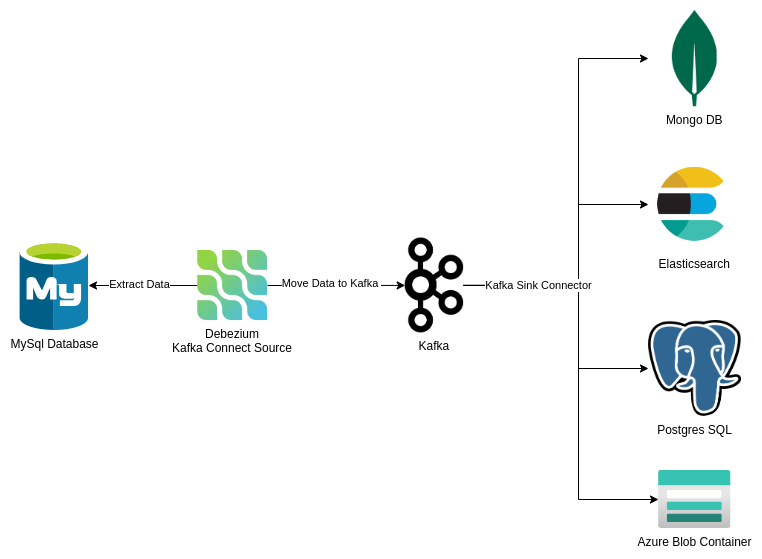

# Kafka Connect - Studies

This project intends to summarize all the knowledge earned during my studies of Kafka Connect

It can be divided into the following sections:

- [Introduction](./00-Introduction.md)
- [Kafka Connect Source](./01-KafkaConnectSource.md)
- [Extracting data from Database with Debezium](./02-KafkaConnectSourceDebezium.md)
- [Moving data to ElasticSearch](./03-KafkaConnectSinkElasticsearch.md)
- [Moving data to MongoDB](./04-KafkaConnectSinkMongoDB.md)
- [Monving data to Postgres Using JDBC Connector](/05-KafkaConnectSinkJDBC.md)
- [Monving data to Azure Blob Connector](/06-KafkaConnectSinkAzureBlob.md)
- [Kafka Connect with Azure Eventhub](./07-KafkaConnectAzureEventhub.md)

## Results
The goal of this study is to extract data from a datasource using kafka source connector, moving it to kafka, and then push this data to another datasource using kafka sink connector

## References

- [Kafka Connect Course](https://www.udemy.com/course/kafka-connect)
- [Confluent Connectors](https://www.confluent.io/hub/)
- [Configuring Connectors](https://kafka.apache.org/documentation.html#connect_configuring)
- [Landoop Include Connectors](https://github.com/lensesio/fast-data-dev#enable-additional-connectors)
- [Kafka Converters and Serialization](https://www.confluent.io/blog/kafka-connect-deep-dive-converters-serialization-explained/#json-schemas)
- [Kafka Transformation](https://www.confluent.io/blog/kafka-connect-single-message-transformation-tutorial-with-examples/)

https://docs.confluent.io/platform/current/kafka/authorization.html
https://supergloo.com/kafka-tutorials/kafka-acl/

https://docs.kafka-ui.provectus.io/configuration/permissions/required-acls

https://medium.com/codex/apache-kafka-series-part-3-securing-our-kafka-cluster-ba25ffcc5778

https://docs.cloudera.com/HDPDocuments/HDP2/HDP-2.6.0/bk_security/content/kafka-acl-examples.html
https://catalog.us-east-1.prod.workshops.aws/workshops/c2b72b6f-666b-4596-b8bc-bafa5dcca741/en-US/securityencryption/saslscram/authorization