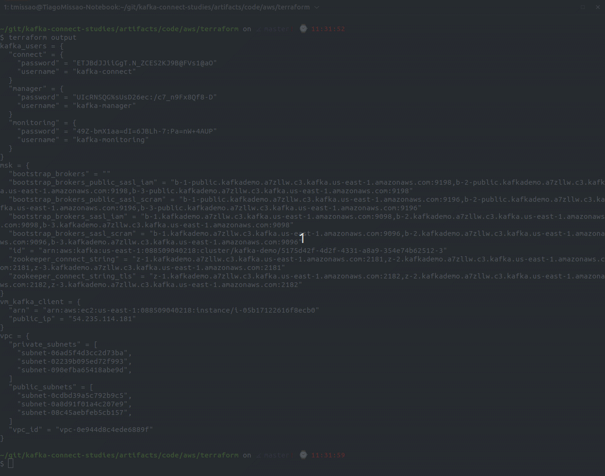

# Provision AWS Kafka Cluster MSK

This project intends to provision all underline infrastructure for [AWS MSK (Amazon Kafka)](https://aws.amazon.com/msk/) enabling public access using SASL/SCRAM and Amazon IAM, also enabling [Kafka-UI](https://github.com/provectus/kafka-ui) in order to monitore the cluster


This project creates 3 users:

- `Kafka Manager` - Super Kafka User with all permissions
- `Kafka Monitoring` - User with read permissions in all topics and groups
- `kafka Connect` - User with read/write permissions in all topics and groups
## Before Beginning
---

In order to this setup fully work, it is necessary to apply the terraform two times since right now it is impossible to make MSK public without first provision it private, configure the required Kafka ACLs and then make it public.

So the follow steps should be executed:

1. Apply the terraform modifing the follow files:
    - Set the value `allow.everyone.if.no.acl.found` to **true** at the [kafka.properties file](./templates/kafka.properties)
    - Set the variable value `kafka.broker_node_group_info.connectivity_info.public_access.type` to **"DISABLED"** at the [variables.tf file](./variables.tf)


2. After the first apply execute the follow configurations
    - Set the value `allow.everyone.if.no.acl.found` to **false** at the [kafka.properties file](./templates/kafka.properties)
    - Set the variable value `kafka.broker_node_group_info.connectivity_info.public_access.type` to **"SERVICE_PROVIDED_EIPS"** at the [variables.tf file](./variables.tf)


## Setup
---
- [Create an Azure Account](https://aws.amazon.com/)
- [Install TF_ENV](https://github.com/tfutils/tfenv)
- [Configure AWS Credentials](artifacts/code/aws/terraform)

```bash
cd artifacts/code/aws/terraform
tfenv install
tfenv use
terraform init

terraform apply
```

## Results
---

In order to test the project, create 3 files based on [kafka-client.properties](./templates/kafka-client.properties)

- manager.properties
- monitoring.properties
- connect.properties

replacing the variables `USERNAME` and `PASSWORD` with the value of output `kafka_users` respectively

And then execute the following commands

```bash
# Create a Kafka Container with Client Credentials
docker container run --rm -it -v $(pwd)/manager.properties:/bitnami/kafka/config/manager.properties -v $(pwd)/connect.properties:/bitnami/kafka/config/connect.properties -v $(pwd)/monitoring.properties:/bitnami/kafka/config/monitoring.properties bitnami/kafka:2.8.1 bash

# Get the Kafka Public Address for SASL/SCRAM
# BROKERS="<public-bootstrap_brokers_public_sasl_scram>"
BROKERS="b-1-public.kafkademo.a7zllw.c3.kafka.us-east-1.amazonaws.com:9196,b-2-public.kafkademo.a7zllw.c3.kafka.us-east-1.amazonaws.com:9196,b-3-public.kafkademo.a7zllw.c3.kafka.us-east-1.amazonaws.com:9196"

# Create a Topic (test) and sending Messages with kafka-connect users
kafka-console-producer.sh --topic test --broker-list $BROKERS --producer.config /bitnami/kafka/config/connect.properties
# >100
# >101
# >102

# Read a Topic (test) with Kafka Connect User
kafka-console-consumer.sh --bootstrap-server $BROKERS --topic test --consumer.config /bitnami/kafka/config/connect.properties --from-beginning
# 101
# 102
# 100


# Read a Topic (test) with Kafka Monitoring User
kafka-console-consumer.sh --bootstrap-server $BROKERS --topic test --consumer.config /bitnami/kafka/config/monitoring.properties --from-beginning
# 101
# 102
# 100


# List Topics with Kafka Manager user
kafka-topics.sh --bootstrap-server $BROKERS --list --command-config /bitnami/kafka/config/manager.properties

# __amazon_msk_canary
# __consumer_offsets
# test
```


