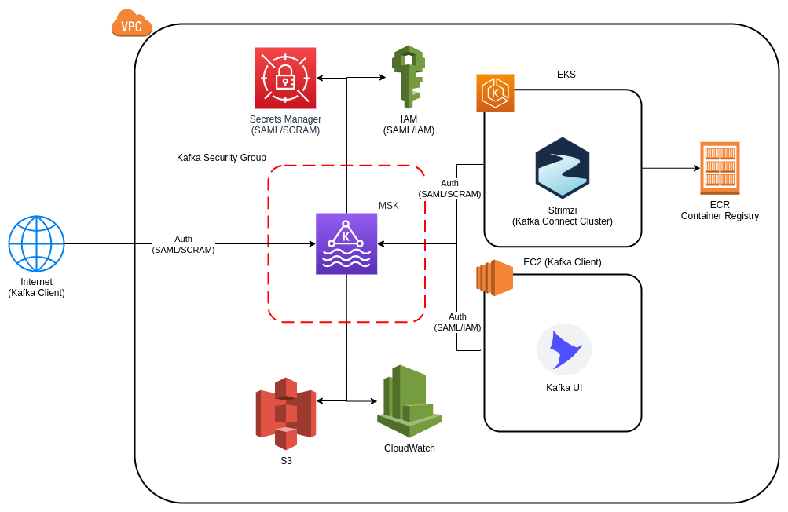

# Provision AWS Kafka Cluster MSK and Kafka Connect on Kubernetes

This project intends to provision all underline infrastructure for [AWS MSK (Amazon Kafka)](https://aws.amazon.com/msk/) enabling authenticated access using SASL/SCRAM and Amazon IAM, an EC2 running [Kafka-UI](https://github.com/provectus/kafka-ui) for monitore the Kafka cluster. And a Kubenetes Cluster with [Strimzi Operator](https://strimzi.io/) in order to deploy a Kafka Connect Cluster.



This project creates 3 users:

- `Kafka Manager` - Super Kafka User with all permissions
- `Kafka Monitoring` - User with read permissions in all topics and groups
- `kafka Connect` - User with read/write permissions in all topics and groups
## Before Beginning
---

In order to this setup fully work, it is necessary to apply the terraform two times the first one configuring ACLs and the second one change the policy to no allow if an ACL was not found.

So the follow steps should be executed:

1. Apply the terraform modifing the follow files:
    - Set the value `allow.everyone.if.no.acl.found` to **true** at the [kafka.properties file](./templates/kafka.properties)


2. After the first apply execute the follow configurations
    - Set the value `allow.everyone.if.no.acl.found` to **false** at the [kafka.properties file](./templates/kafka.properties)


## Setup
---
- [Create an AWS Account](https://aws.amazon.com/)
- [Install AWS CLI](https://docs.aws.amazon.com/cli/latest/userguide/getting-started-install.html)
- [Configure AWS CLI](https://docs.aws.amazon.com/cli/latest/userguide/cli-authentication-user.html)
- [Install TF_ENV](https://github.com/tfutils/tfenv)
- [Configure Terraform AWS Authentication](https://registry.terraform.io/providers/hashicorp/aws/latest/docs#environment-variables)
- [Install Docker](https://docs.docker.com/engine/install/ubuntu/)
- [Install Kubectl](https://kubernetes.io/docs/tasks/tools/)

```bash
cd artifacts/code/aws/terraform
tfenv install
tfenv use
terraform init

terraform apply
```

## Results
---

### Testing the MSK (Kafka Cluster)

In order to test the project, access the client EC2 using its public IP (`vm_kafka_client.public_ip`) and create 3 files based on [kafka-client.properties](./templates/kafka-client.properties)

- manager.properties
- monitoring.properties
- connect.properties

replacing the variables `USERNAME` and `PASSWORD` with the value of output `kafka_users` respectively

And then execute the following commands

```bash
# Create a Kafka Container with Client Credentials
docker container run --rm -it -v $(pwd)/manager.properties:/bitnami/kafka/config/manager.properties -v $(pwd)/connect.properties:/bitnami/kafka/config/connect.properties -v $(pwd)/monitoring.properties:/bitnami/kafka/config/monitoring.properties bitnami/kafka:3.4.0 bash

# Get the Kafka Public Address for SASL/SCRAM
# BROKERS="<public-bootstrap_brokers_public_sasl_scram>"
BROKERS="b-1-public.kafkademo.a7zllw.c3.kafka.us-east-1.amazonaws.com:9096,b-2-public.kafkademo.a7zllw.c3.kafka.us-east-1.amazonaws.com:9096,b-3-public.kafkademo.a7zllw.c3.kafka.us-east-1.amazonaws.com:9096"

# Create a Topic (test) and sending Messages with kafka-connect users
kafka-console-producer.sh --topic test --broker-list $BROKERS --producer.config /bitnami/kafka/config/connect.properties
# >100
# >101
# >102

# Read a Topic (test) with Kafka Connect User
kafka-console-consumer.sh --bootstrap-server $BROKERS --topic test --consumer.config /bitnami/kafka/config/connect.properties --from-beginning
# 101
# 102
# 100


# Read a Topic (test) with Kafka Monitoring User
kafka-console-consumer.sh --bootstrap-server $BROKERS --topic test --consumer.config /bitnami/kafka/config/monitoring.properties --from-beginning
# 101
# 102
# 100


# List Topics with Kafka Manager user
kafka-topics.sh --bootstrap-server $BROKERS --list --command-config /bitnami/kafka/config/manager.properties

# __amazon_msk_canary
# __consumer_offsets
# test
```

### Testing the Kafka-UI

Access the Kafka-UI using the kube-forward command
```bash
# login on cluster Kubernetes
# aws eks update-kubeconfig --name <cluster-name> --region <region>
aws eks update-kubeconfig --name demo-cluster --region us-east-1

#kubectl port-forward service/<service-name> <localhost-port>:<service-port> -n kafka
kubectl port-forward service/kafka-ui 8080:80 -n kafka

# Open the address localhost:8080 on your web browser
```


### Testing the Kafka Connect Cluster

Configure the Kubectl Credentials and check the status of the Kafka Connector, and Kafka Connectors

```bash
# aws eks update-kubeconfig --name <eks-cluster-name> --region <region>
aws eks update-kubeconfig --name demo-cluster --region us-east-1

# Get Kafka Connect
kubectl get KafkaConnect -n kafka -o wide
# NAME                  DESIRED REPLICAS   READY
# k8s-connect-cluster   2                  True

# Get Kafka Connect Pods
kubectl get pods -n kafka -o wide
# NAME                                          READY   STATUS    RESTARTS   AGE
# k8s-connect-cluster-connect-d6564f4c4-fv2qt   1/1     Running   0          19h
# k8s-connect-cluster-connect-d6564f4c4-r6mvg   1/1     Running   0          19h
# strimzi-cluster-operator-75f57bc754-blpgm     1/1     Running   0          2d3h

# Get Kafka Connectors
kubectl get KafkaConnectors -n kafka
# NAME                                  CLUSTER               CONNECTOR CLASS                                           MAX TASKS   READY
# filestream-license-source-connector   k8s-connect-cluster   org.apache.kafka.connect.file.FileStreamSourceConnector   2           True
# filestream-license-synk-connector     k8s-connect-cluster   org.apache.kafka.connect.file.FileStreamSinkConnector     2           True
```


## References
---

- [MSK with SASL/SCRAM](https://docs.aws.amazon.com/msk/latest/developerguide/msk-password.html)
- [MSK with SASL/IAM](https://docs.aws.amazon.com/msk/latest/developerguide/iam-access-control.html)
- [Kafka ACL Tutorial](https://supergloo.com/kafka-tutorials/kafka-acl/)
- [Confluent Authorization Documentation](https://docs.confluent.io/platform/current/kafka/authorization.html)
- [Kafka UI](https://github.com/provectus/kafka-ui)
- [Kafka UI Required Permissions](https://docs.kafka-ui.provectus.io/configuration/permissions/required-acls)
- [Strimzi Configuring Kafka Connect](https://strimzi.io/docs/operators/latest/deploying#con-kafka-connect-config-str)
- [Strimzi Add Custom Plugins](https://strimzi.io/docs/operators/latest/configuring.html#plugins)
- [Strimzi Add Custom Plugins Docker](https://strimzi.io/docs/operators/latest/full/deploying.html#creating-new-image-from-base-str)
- [Strimzi Deploying Connectors](https://strimzi.io/docs/operators/latest/deploying#proc-deploying-kafkaconnector-str)
- [Strimzi Load Configuration from Secrets](https://strimzi.io/docs/operators/latest/deploying#assembly-loading-config-with-providers-str)
- [Apicurio Schema Registry Client Configuration](https://www.apicur.io/registry/docs/apicurio-registry/2.4.x/getting-started/assembly-configuring-kafka-client-serdes.html)
- [Apicurio with Debezium](https://debezium.io/documentation/reference/stable/configuration/avro.html#overview-of-deploying-a-debezium-connector-that-uses-avro-serialization)
- [Apicurio Examples](https://github.com/debezium/debezium-examples/blob/main/tutorial/register-mysql-apicurio-converter-avro.json)